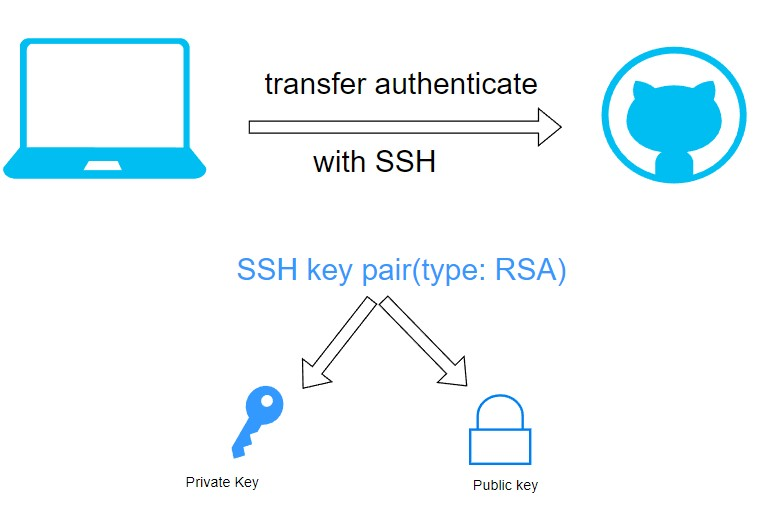
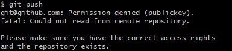

# SSH to push changes to your GitHub repo
- [SSH to push changes to your GitHub repo](#ssh-to-push-changes-to-your-github-repo)
- [Task: Re-create SSH setup to authenticate to GitHub](#task-re-create-ssh-setup-to-authenticate-to-github)
- [# Task: Document 'Use SSH authentication with a repo on GitHub'](#-task-document-use-ssh-authentication-with-a-repo-on-github)
  - [Delete test repo and SSH key.](#delete-test-repo-and-ssh-key)
  - [Use a pre-existing repo, and switch it over to use SSH keys](#use-a-pre-existing-repo-and-switch-it-over-to-use-ssh-keys)
- [(If time) Task: Use a new Git Bash window to push a change with SSH](#if-time-task-use-a-new-git-bash-window-to-push-a-change-with-ssh)



**Steps** 
1. Create SSH Key pair
```bash
cd .ssh
```
```bash
pwd
```
```bash
ssh-keygen -t rsa -b 4096 -C "your email address"
```
```bash
tech264-maria-github-key
```

2. Register the padlock
   
**GitHub** -> **Settings** -> **SSH and GPG keys** -> **New SSH key** 

**Add new SSH Key**
- -> **Name** : `tech264-maria-github-key`
- -> **Key type** : `authentification key `
- -> **Key** to get the key -> in **Git Bash** -> `cat tech264-maria-github-key.pub `-> **copy** the `pub key` and **paste** `into key github `-> **Add SSH Key**

3. Add private key to SSH register
```bash
eval `ssh-agent -s`
```
```bash
ssh-add <private key name>
```
```bash
ssh -T git@github.com
```
4. Create test repo

**GitHub** -> Create a **new repo** -> Use **SSH to connect** 

**First Method**: In OneDrive/gitfolders -> `mkdir` tech264-maria-test-ssh -> `cd` tech264-maria-test-ssh -> `ls` -> `echo " readme.md" >> README.md` -> `ls` -> `cat README.md` -> `git init` -> `git add .` -> `git commit -m " first commit"` -> `git branch -M main` -> `git remote add origin` `git@github.com:<git name>/tech264-maria-test-ssh.git` -> `git push -u origin main`

Remove :
`rm -rf tech264-maria-test-shh/`

**Second Method** : 
`git clone git@github.com:<git name>/tech264-maria-test-ssh.git`


# Task: Re-create SSH setup to authenticate to GitHub


# # Task: Document 'Use SSH authentication with a repo on GitHub'


## Delete test repo and SSH key.
1. Deleted `tech264-maria-github-test` repo from github and local directory.
2. Navigated to **Account** > **Settings** > **SSH and GPG keys** and **delete** the SSH key.
3. Locally we cd ~/.ssh and delete the newlly created ssh key pair.
```bash
rm <private key> <public key>
```

## Use a pre-existing repo, and switch it over to use SSH keys
 
1. We generate a new SSH key pair and sore them as `tech264-maria-github-key`.
```bash
ssh-keygen -t rsa -b 4096 -C "your_email@example.com"
```
2. We publish the publib ssh key on GitHUb within the **SSH and GPG keys** section on Github.
3. Register the `private key` with ssh.
 ```bash
eval `ssh-agent -s`
```
```bash
ssh-add tech264-maria-github-key
```
4. Test the connection with GitHub
 
```bash
ssh -T git@github.com
```
5. Navigate to a current active github repo on the local machine already connected with the remote repo.
 
6. Run the `git remote -v` command to display the connection type of my Git repository. This command lists all configured remote repositories along with their URLs, which helps me see if my repository is connected via HTTPS or SSH. If the URL starts with `https://`, it’s using an HTTPS connection. If it starts with `git@` (e.g., git@github.com:username/repo.git), it’s using SSH.
 
```bash
git remote -v
```
 
7. Within the Github repo there is a **Code** drop down that provides the SSH origin connection. Run the below command accompanied with the SSH connection to switch origin from HTTPS to SSH. *Note: The command must be ran in whilst within the local repo*.
 
```bash
git remote set-url origin git@github.com:<github name>/tech264-test-git.git
```


# (If time) Task: Use a new Git Bash window to push a change with SSH


```bash
git push
```



1. Verify SSH Authentication
To check if the issue is related to SSH, first verify that you can connect to GitHub via SSH by running:

```bash
ssh -T git@github.com
```


2. Start the SSH Agent

```bash
eval `ssh-agent -s`
```
```bash
ssh-add tech264-maria-github-key
```
```bash
git push origin main
```

